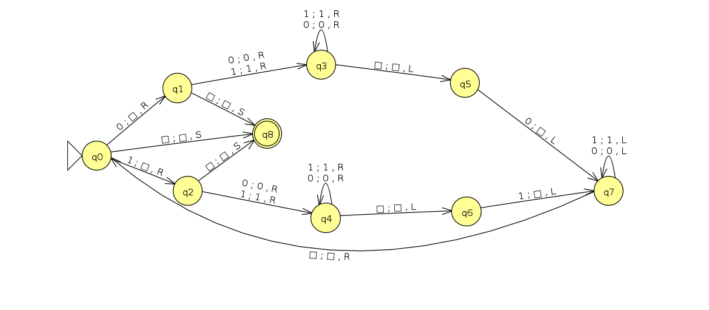
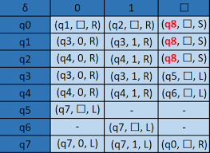

# Máquina de Turing

## Uma Máquina de Turing é uma 7-tupla?

  Uma Máquina de Turing é uma 7-tupla M = (Q, Σ, Γ, δ, q0, B, F), onde:

-  **Q** é um conjunto finito de estados;

-  **Σ** conjunto finito de símbolos de entrada.

-  **Γ** conjunto - completo de símbolos, Σ é um subconjunto.

-  **δ** é uma função parcial δ: Q × Γ → Q × Γ × {L,R}, chamada de função de transição.

-  **q0** ∈ Q é o estado inicial;

-  **B (ou ☐)** é um símbolo que representa um branco (está em Γ mas não em Σ).

-  **F** ∈ Q é o subconjunto de estados finais.

### M = ( {q0, q1, q2, q3, q4, q5, q6, q7, q8}, {0,1}, {0,1,B}, δ, q0, B, {q8} )

## Alfabeto:

**0, 1**

## Diagrama de Estados:

## Função de transição (δ):

